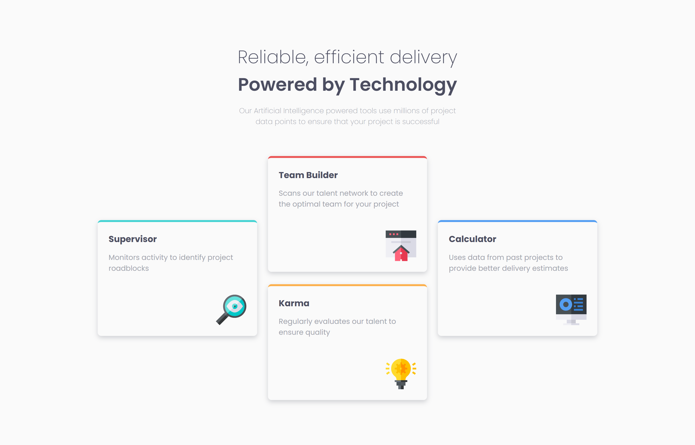

# Frontend Mentor - Four card feature section solution

This is a solution to the [Four card feature section challenge on Frontend Mentor](https://www.frontendmentor.io/challenges/four-card-feature-section-weK1eFYK). Frontend Mentor challenges help you improve your coding skills by building realistic projects. 

## Table of contents

- [Overview](#overview)
  - [The challenge](#the-challenge)
  - [Screenshot](#screenshot)
  - [Links](#links)
- [My process](#my-process)
  - [Built with](#built-with)
  - [What I learned](#what-i-learned)
  - [Useful resources](#useful-resources)
- [Author](#author)

## Overview

### The challenge

Users should be able to:

- View the optimal layout for the site depending on their device's screen size

### Screenshot



### Links

- Solution URL: [Add solution URL here](https://your-solution-url.com)
- Live Site URL: [Add live site URL here](https://your-live-site-url.com)

## My process

### Built with

- Semantic HTML5 markup
- CSS custom properties
- Flexbox
- CSS Grid
- Mobile-first workflow
- [Scss](https://sass-lang.com/guide/) - CSS extension language


### What I learned

I learnt more about CSS grid, this is my first time using it to such degree.

```css
@include mq.respond(desktop) {
  .cards {
    grid-template: repeat(4, 1fr) / repeat(3, 1fr);
    grid-template-areas:
      ". team ."
      "supervisor team calc"
      "supervisor karma calc"
      ". karma .";
  }
}

```

### Useful resources

- [An Interactive Guide to CSS Grid](https://www.joshwcomeau.com/css/interactive-guide-to-grid/) - This helped me for understand CSS grid basic and practical usage. I really liked using CSS grid and I'll use it more often going forward
- [Grid garden](https://cssgridgarden.com/) - This is an amazing game to help practice CSS grid .


## Author

- Frontend Mentor - [@shadowbanks](https://www.frontendmentor.io/profile/shadowbanks)
- X(Twitter) - [@Shadowbanks_](https://x.com/Shadowbanks_)
